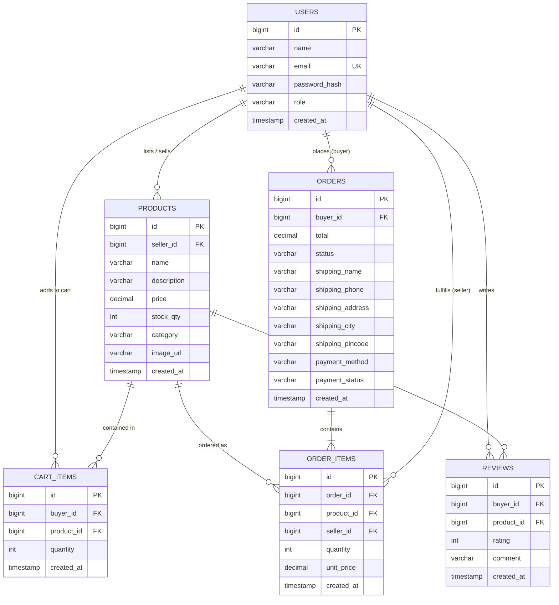
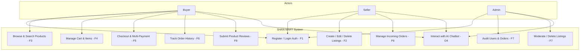
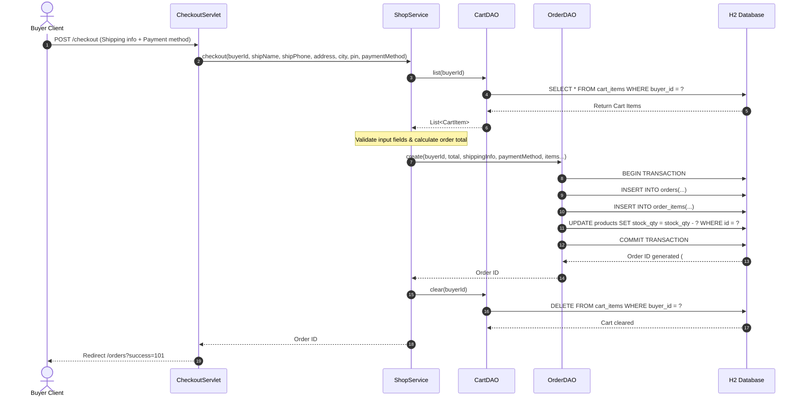

# SHAN MART Capstone — Final Comprehensive Report

**Course / Institution**: Anna University R2025, Semester 3  
**Project Name**: SHAN MART (`com.shanjay.mart`)  
**Technology Stack**: Java Servlets 4.0 · JDBC · HikariCP · H2 Database · Apache Tomcat 9.0.x · JUnit 5 & Mockito  
**Author / Builder**: Solo Capstone Build  

---

## 1. Executive Summary & Problem Statement

Modern e-commerce platforms require robust multi-role capabilities, real-time inventory synchronization, transparent order tracking, security hardening, and intelligent customer assistance. **SHAN MART** is a production-ready, full-stack Java web application engineered to solve these challenges.

The system provides:
- **Buyer Persona**: Seamless storefront browsing, keyword search, category filtering, cart management, multi-payment options (Card, UPI, Net Banking, COD), order tracking, and 5-star product review submission.
- **Seller Persona**: Dedicated Seller Central inventory dashboard to publish, edit, stock-manage, and fulfill incoming orders.
- **Admin Persona**: Platform-wide user account auditing, product catalog moderation, and executive KPI analytics.
- **AI Customer Assistant**: Embedded AI Chatbot (Phase 3) powered by `ChatProvider` architecture (Gemini REST API / Mock) offering instant 24/7 customer support.

---

## 2. System Architecture & Component Design

SHAN MART follows the standard 4-tier Java Enterprise Architecture pattern:

1. **Presentation Layer**: Responsive JSP views (`buyer.jsp`, `seller.jsp`, `admin.jsp`, `cart.jsp`, `checkout.jsp`, `orders.jsp`, `login.jsp`, `register.jsp`, `error.jsp`) styled with a modern Meesho/Amazon-inspired design system (`style.css`), dynamic AJAX modals, and a floating AI chatbot widget (`chatbot.js`).
2. **Control Layer**: Front-Controller Servlets implementing routing, authentication filters (`AuthFilter`), and global UTF-8 encoding filters (`EncodingFilter`).
3. **Service & Business Logic Layer**: `ShopService`, `AuthService`, and `ChatService` managing transaction rules, cart total calculations, field validation, rate limiting, and fallback handling.
4. **Data Access Layer**: Interface/DAO pattern (`UserDAO`, `ProductDAO`, `CartDAO`, `OrderDAO`, `ReviewDAO`) using parameterized `PreparedStatement` and HikariCP connection pooling against an H2 database engine.

---

## 3. Design Patterns Applied

| Design Pattern | Implementation Location | Purpose & Benefit |
|---|---|---|
| **DAO Pattern (Data Access Object)** | `UserDAO`, `ProductDAO`, `CartDAO`, `OrderDAO`, `ReviewDAO` | Encapsulates raw JDBC SQL operations, decoupling database interactions from domain services. |
| **Front Controller Pattern** | Servlets (`ShopServlet`, `CheckoutServlet`, `ChatServlet`, etc.) | Centralizes request handling, session management, view routing, and HTTP response formatting. |
| **Singleton Pattern** | `HikariDataSource` in `AppListener` | Ensures a single shared database connection pool lifecycle across the entire web application. |
| **Strategy Pattern** | `ChatProvider` (`MockChatProvider` vs `GeminiChatProvider`) | Enables dynamic runtime switching of LLM providers based on configuration (`ai.chatbot.provider`). |
| **Factory Pattern** | `ApiResponse.ok(data)` / `ApiResponse.fail(error)` | Standardizes REST JSON envelope creation across API endpoints. |
| **Builder / DTO Pattern** | `UserResponseDTO`, `CartItem`, `Order`, `Review` | Prevents exposing internal entity states (e.g. `passwordHash`) over public network payloads. |

---

## 4. Complete System Diagrams

### D1: Entity-Relationship Diagram (ERD)

---

### D2: Use Case Diagram

---

### D3: Sequence Diagram (Place-Order Flow)

---

## 5. Security & Quality Audit Verification

| Security Checklist Item | Implementation Status | Evidence / Verification |
|---|---|---|
| **SQL Injection Prevention** | 100% Verified | All SQL queries in `UserDAO`, `ProductDAO`, `CartDAO`, `OrderDAO`, `ReviewDAO` use `PreparedStatement`. Zero string concatenation. |
| **Password Hashing** | 100% Verified | Passwords hashed with `jBCrypt` salt round 10 via `Password.hash()`. |
| **Session Protection** | 100% Verified | Session regenerated on login; explicit 30-minute timeout configured in `web.xml`; protected routes guarded by `AuthFilter`. |
| **Output XSS Escaping** | 100% Verified | Dynamic JSP fields escaped via HTML entity escaping and JSTL tags. |
| **Custom Error Handling** | 100% Verified | `web.xml` maps 404, 500, and `java.lang.Throwable` to `/WEB-INF/views/error.jsp`. Stack traces are strictly hidden. |
| **API Secret Exclusion** | 100% Verified | `.env` and `config.properties` excluded in `.gitignore`. API keys loaded from server-side environment variables. |
| **Automated Testing** | 100% Green | 15 JUnit 5 + Mockito unit tests passing via `mvn clean test`. |

---

## 6. Known Limitations & Future Scope

1. **Payment Gateway Integration**: Current checkout simulates transactions via card, UPI, net banking, and COD. Integrating a live PG (Razorpay/Stripe) can be added in production.
2. **File Upload Storage**: Product images currently accept hosted image URLs (Unsplash CDN). Direct multipart image file uploading to S3/Cloud Storage can be expanded.
