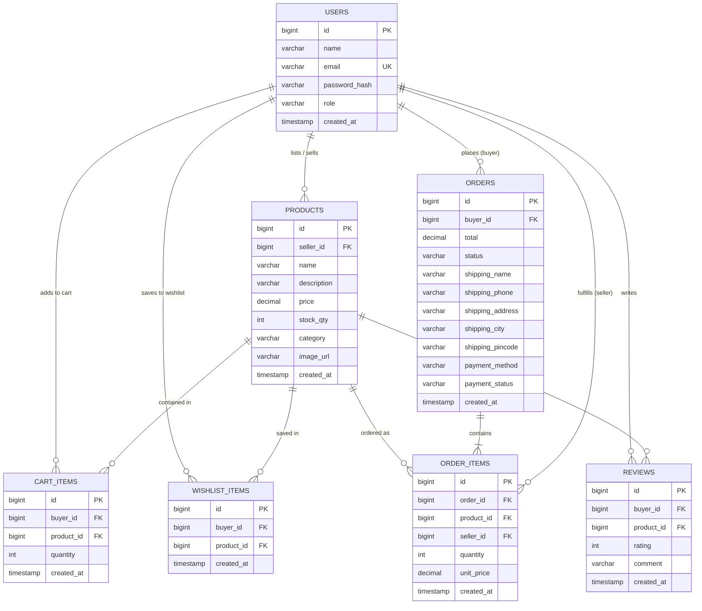
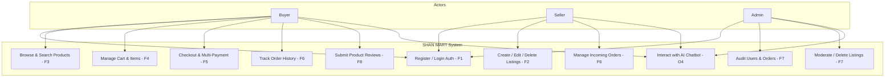
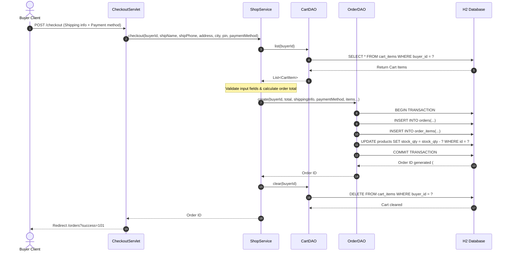

# SHAN MART — E-Commerce Marketplace Platform

A production-ready Maven + Java 17 + Servlet 4.0/JSP + Apache Tomcat 9 e-commerce capstone application implementing all specifications through **Week 11 (Final Review Checkpoint)**, including complete shopping workflows, multi-role authentication, order status management, review engine, security hardening, and **AI Chatbot Integration (Phase 3)**.

---

## Architecture & System Design

SHAN MART follows a clean, layered architectural pattern adhering to standard J2EE enterprise practices:
- **Presentation Layer**: JSP views styled with modern CSS (Meesho & Amazon aesthetics), responsive layouts, Product Full View page, Wishlist portal, Account Profile, Buyer Dashboard, floating interactive AI Chatbot widget, and dynamic AJAX modal interactions for reviews and catalog search.
- **Controller Layer**: Front Controller Servlets (`ShopServlet`, `ProductServlet`, `WishlistServlet`, `CartServlet`, `CheckoutServlet`, `OrdersServlet`, `ReviewServlet`, `ProfileServlet`, `DashboardServlet`, `HealthServlet`, `ChatServlet`, `LoginServlet`, `RegisterServlet`, `LogoutServlet`).
- **Service Layer**: `ShopService`, `AuthService`, `ChatService` enforcing business rules, cart calculation, wishlist state, input validation, stock tracking, rate limiting, and LLM fallback.
- **Data Access Layer (DAO)**: `UserDAO`, `ProductDAO`, `WishlistDAO`, `CartDAO`, `OrderDAO`, `ReviewDAO` using parameterized JDBC `PreparedStatement` with HikariCP connection pooling.
- **Persistence Layer**: H2 Database (`~/shan_mart_v7.mv.db`) with automatic schema migration, indexes on foreign keys, and seed data.

```
                  ┌─────────────────────────────────────┐
                  │          Browser Client             │
                  └──────────────────┬──────────────────┘
                                     │ HTTP (REST & Form)
                                     ▼
                  ┌─────────────────────────────────────┐
                  │    EncodingFilter & AuthFilter      │
                  └──────────────────┬──────────────────┘
                                     │
           ┌─────────────────────────┼────────────────────────┐
           │                         │                        │
           ▼                         ▼                        ▼
  ┌─────────────────┐       ┌─────────────────┐      ┌─────────────────┐
  │   ShopServlet   │       │ CheckoutServlet │      │   ChatServlet   │
  │ (Catalog & UI)  │       │ (Multi-Payment) │      │ (AI Assistant)  │
  └────────┬────────┘       └────────┬────────┘      └────────┬────────┘
           │                         │                        │
           └─────────────────────────┼────────────────────────┘
                                     │
                                     ▼
                  ┌─────────────────────────────────────┐
                  │     ShopService / ChatService       │
                  └──────────────────┬──────────────────┘
                                     │
         ┌───────────────┬───────────┴───────────┬──────────────┬──────────────┐
         ▼               ▼                       ▼              ▼              ▼
   ┌───────────┐   ┌───────────┐           ┌───────────┐  ┌───────────┐  ┌───────────┐
   │ ProductDAO│   │WishlistDAO│           │  CartDAO  │  │ OrderDAO  │  │ ReviewDAO │
   └─────┬─────┘   └─────┬─────┘           └─────┬─────┘  └─────┬─────┘  └─────┬─────┘
         │               │                       │              │              │
         └───────────────┴───────────┬───────────┴──────────────┴──────────────┘
                                     │ JDBC (HikariCP)
                                     ▼
                  ┌─────────────────────────────────────┐
                  │          H2 Database (~/shan_mart)  │
                  └─────────────────────────────────────┘
```

---

## Architectural Diagrams

### D1: Entity-Relationship Diagram (ERD)



---

### D2: System Use Case Diagram



---

### D3: Sequence Diagram (Place-Order Flow)



---

## Tech Stack

| Component | Technology / Library | Version / Details |
|---|---|---|
| **Runtime** | Java Development Kit (JDK) | 17 LTS |
| **Build Tool** | Apache Maven | 3.9+ |
| **Web Container** | Apache Tomcat | 9.0.x (`javax.servlet.*`) |
| **Connection Pool** | HikariCP | 5.1.0 |
| **Database** | H2 Database Engine | 2.2.224 (MySQL Compatibility Mode) |
| **Security & Auth** | jBCrypt | 0.4 |
| **Serialization** | Jackson Databind | 2.17.2 |
| **Testing & Mocking**| JUnit 5 Jupiter + Mockito | 5.10.3 / 5.11.0 |
| **Code Quality** | Checkstyle & SpotBugs Maven Plugins | 3.3.1 / 4.8.3.0 |
| **AI Integration** | ChatProvider (Gemini REST API / Mock) | `ai.chatbot.provider=gemini|mock` |
| **Styling** | Vanilla CSS3 Design System | Meesho & Amazon Inspired Aesthetics |

---

## Features Implemented (Full Capstone)

### Core Features (F1 – F8 & O4)
- **F1 Authentication & Security**: Multi-role signup (Buyer/Seller), password hashing with **jBCrypt**, `AuthFilter` session checks, and `EncodingFilter` (UTF-8).
- **F2 Listing Management**: Sellers create, edit, and delete product listings with image URLs, stock quantities, and pricing.
- **F3 Search & Filtering**: Multi-category filter pills and keyword search.
- **F4 Shopping Cart**: Add to cart, adjust quantities, remove items, running total calculation.
- **F5 Checkout & Multi-Payment**: Address collection, mock credit card, UPI/QR code, net banking, and Cash on Delivery (COD).
- **F6 Order History & Fulfillment**: Buyer order tracking and Seller order fulfillment views.
- **F7 Admin Panel**: Platform user account auditing, KPI dashboards, catalog moderation.
- **F8 Reviews & Star Ratings**: 5-star rating submission modal, average rating badge computation, and AJAX review fetcher.
- **O2 Order Status Workflow**: Status transitions: PENDING → CONFIRMED → SHIPPED → DELIVERED → CANCELLED.
- **O4 AI Chatbot Widget (Phase 3)**:
  - `ChatProvider` interface architecture with `MockChatProvider` and `GeminiChatProvider`.
  - Rate limiting (max 10 msgs/min per session).
  - Input length validation (max 500 characters).
  - In-memory per-session question caching.
  - Floating UI widget on all pages with quick FAQ chips.

---

## Seed Accounts

| Role | Email | Password | Access Rights |
|---|---|---|---|
| **Buyer** | `buyer@shanjaymart.local` | `1234` | Browse, Cart, Checkout, Reviews, Order Tracking |
| **Seller** | `seller@shanjaymart.local` | `1234` | Inventory Dashboard, Add/Edit Listings, Manage Orders |
| **Admin** | `admin@shanjaymart.local` | `1234` | Platform KPIs, User Audit, Catalog Moderation |

---

## How to Run Locally

### Build & Test
```bash
# Run unit, DAO, and service tests with Mockito
mvn clean test

# Build production WAR package
mvn clean package
```

### Deploy to Tomcat
1. Copy `target/shanjays-mart.war` to Tomcat's `webapps/` folder.
2. Start Tomcat (`bin/startup.bat` or `bin/startup.sh`).
3. Open `http://localhost:8080/shanjays-mart/` in your browser.

### Verification Endpoints
```bash
# Health Check Endpoint
curl http://localhost:8080/shanjays-mart/api/v1/health
# Output: {"status":"UP","db":"UP"}

# AI Chatbot API Endpoint
curl -X POST http://localhost:8080/shanjays-mart/api/chat -H "Content-Type: application/json" -d "{\"message\":\"What is your shipping policy?\"}"
# Output: {"success":true,"data":{"reply":"🚚 SHAN MART offers Free Delivery on all eligible orders across India! Standard delivery typically takes 2 to 4 business days."}}
```
